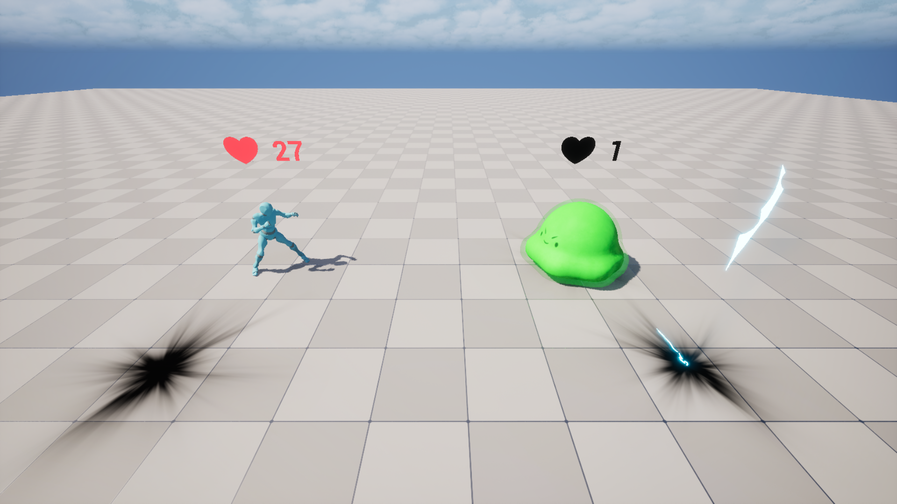
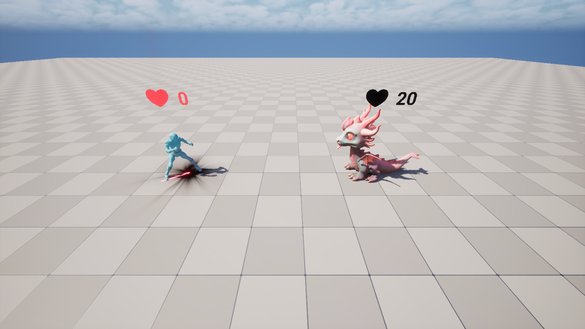

# Тестовое задание по направлению Программирование Lesta Academy

Написать прототип игры, пошагового автобаттлера, в котором игрок только создаёт и прокачивает персонажа, а бои проходят автоматически.

Язык выполнения - любой. Визуальное оформление - на усмотрение кандидата. Можно сделать и обычное консольное приложение.

## Основной цикл игры

1. В начале игрок выбирает класс персонажа (воин, варвар или разбойник).
2. Персонаж сражается со случайным монстром:

- Бои идут в пошаговом режиме.
- Персонаж и монстр атакуют по очереди, пока у кого-то из них здоровье не достигнет 0.

3. Если персонаж победил, он повышает уровень, его здоровье восстанавливается до максимума и ему предлагается заменить его текущее оружие на то, что выпало из монстра.
4. Если персонаж проиграл - игроку предлагается создать нового персонажа. Возврат к пункту 1.
5. Если персонаж победил 5 монстров подряд - сообщаем игроку, что игра пройдена.

## Создание персонажа

У персонажа есть 3 атрибута:

- Сила: значение силы прибавляется к урону от оружия.
- Ловкость: повышает шанс попасть или уклониться от атаки. Подробнее - в разделе Бой.
- Выносливость: значение выносливости прибавляется к здоровью при каждом повышении уровня.

У нового персонажа они равны случайному числу от 1 до 3 включительно.

В начале игры игрок выбирает класс персонажа.

---

Таблица классов

| Класс | Здоровье   за уровень | Начальное   оружие | Бонус на 1 уровне | Бонус на 2 уровне | Бонус на 3 уровне |
| :-- | :-- | :-- | :-- | :-- | :-- |
| Разбойник | 4 | Кинжал | Скрытая атака:   +1 к урону если   ловкость персонажа   выше ловкости цели | Ловкость +1 | Яд:   Наносит   дополнительные +1   урона на втором   ходу, +2 на третьем   и так далее. |
| Воин | 5 | Меч | Порыв к действию:   В первый ход наносит   двойной урон   оружием | Щит:   -3 к получаемому   урону если сила   персонажа выше   силы атакующего | Сила +1 |
| Варвар | 6 | Дубина | Ярость:   +2 к урону в первые 3   хода, потом -1 к урону | Каменная кожа:   Получаемый урон   снижается на   значение   выносливости | Выносливость +1 |

Таблица оружия

| Название | Урон | Тип урона |
| :-- | :-- | :-- |
| Меч | 3 | Рубящий |
| Дубина | 3 | Дробящий |
| Кинжал | 2 | Колющий |
| Топор | 4 | Рубящий |
| Копье | 3 | Колющий |
| Легендарный Меч | 10 | Рубящий |

## Пример

Игроку выпали начальные стать: Сила 1, Ловкость 3, Выносливость 2. Он выбирает класс "Разбойник": у него 6 единиц здоровья (4 за 1 уровень разбойника и 2 от выносливости), он вооружён кинжалом, которым наносит 3 единицы колющего урона за атаку (2 единицы от самого кинжала +1 от силы), а также его урон повышается на 1 если у его цели ловкость ниже чем у него самого.

## Бой

Для каждого боя выбирается случайный противник из списка:

| Противник | Здоровье | Урон   оружия | Сила | Ловкость | Выносливность | Особенности | Награда за   победу |
| :-- | :-- | :-- | :-- | :-- | :-- | :-- | :-- |
| Гоблин | 5 | 2 | 1 | 1 | 1 |  | Кинжал |
| Скелет | 10 | 2 | 2 | 2 | 1 | Получает вдвое   больше урона, если   его бьют дробящим   оружием | Дубина |
| Слайм | 8 | 1 | 3 | 1 | 2 | Рубящее оружие не   наносит ему урона   (но урон от силы и   прочих   особенностей, даже   "порыва к действию"   воина, работает) | Копье |
| Призрак | 6 | 3 | 1 | 3 | 1 | Есть способность   "скрытая атака", как   у разбойника 1-го   уровня | Меч |
| Голем | 10 | 1 | 3 | 1 | 3 | Есть способность   "каменная кожа",   как у Варвара 2-го   уровня | Топор |
| Дракон | 20 | 4 | 3 | 3 | 3 | Каждый 3-й ход   дышит огнём,   нанося   дополнительно 3   урона | Легендарный   Меч |

Бой идёт по ходам, персонаж и монстр атакуют друг друга по очереди. Первым ходит тот, у кого выше ловкость. Если она одинаковая, то первым ходит персонаж.

1. При атаке сначала вычисляется шанс попадания: берётся случайное число от единицы до суммы ловкости атакующего и цели. Если это число меньше или равно ловкости цели - атака промахнулась.
2. Если атака попала, то считается изначальный урон: это урон оружия атакующего + его сила.
3. Применяются все эффекты на атаки у атакующего (Порыв к действию, Ярость и другие).
4. Применяются все эффекты на урон цели (Каменная кожа, Щит и другие).
5. Если итоговый урон больше 0 - его значение вычитается из здоровья цели.
6. Если здоровье цели опустилось до 0 или ниже - бой заканчивается победой атакующего.
7. Если цель выжила, то теперь её очередь атаковать. Переходим к пункту 1.

## После боя

После каждого боя здоровье персонажа восстанавливается до максимума. Затем игроку предлагают повысить уровень персонажа. Как и в "серьёзных" RPG, у нас есть возможность мультикласса: при повышении уровня игрок может выбрать не только тот класс, с которым он начал игру, но и любой другой. Тогда он получит +1 уровень в этом классе, и все бонусы от этого уровня. Максимальный суммарный уровень персонажа - 3. Когда он достигнут, игроку больше не предлагают повысить уровень, после боя только восстанавливается здоровье.

--- 

Например, если игрок в начале выбрал варвара, а после победы над первым монстром выбрал воина, то его персонаж теперь - варвар 1 / воин 1. В первый ход он наносит и дополнительный урон, равный урону его оружия (бонус 1-го уровня воина), и +2 урона от ярости варвара.

---

